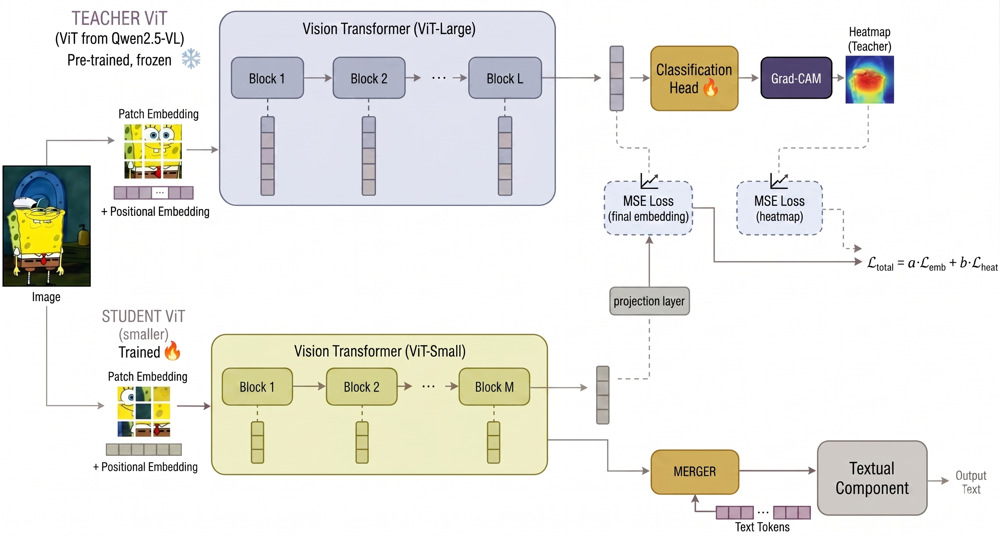

# Explanation-Guided Knowledge Distillation

This project investigates whether visual explanations can provide a useful supervision signal for knowledge distillation in a vision-language model. A ViT-based visual student is trained to replace the visual module of `Qwen/Qwen2.5-VL-3B-Instruct`; the language model remains unchanged, and final evaluation is performed on generated responses after replacement.

[Report PDF](docs/Report.pdf) | [Slides PDF](docs/Slides.pdf)



## Project Idea

The baseline reconstructs teacher visual features globally using an MSE loss. The proposed variants add, or use exclusively, a local loss weighted by Grad-CAM:

1. The frozen Qwen visual module produces visual tokens on Mini-ImageNet.
2. Three supervised probes, `mean`, `attention`, and `cross_attention`, are trained to classify images from the frozen tokens.
3. Grad-CAM on the selected probe produces a relevance weight for each visual region.
4. A `vit_base_patch16_224` student, projected into the teacher feature dimension, is trained to reconstruct Qwen image embeddings.
5. The student embeddings are inserted into Qwen's generation pipeline and compared against teacher outputs through generated responses.

The experiment matrix compares the following losses:

| Variant | Saliency signal | Objective |
| --- | --- | --- |
| `D-mse` | None | Global MSE |
| `D-expl-only` | Probe Grad-CAM | Explanation-weighted local MSE |
| `D-mse-expl` | Probe Grad-CAM | Global MSE + explanation-weighted local MSE |

For `D-expl-only` and `D-mse-expl`, all three probe types are evaluated. `D-mse` is a single probe-free baseline.

<!-- ## Main Results

The primary report metric is an image-grounded blind comparison: three local VLM judges observe the original image and two anonymized responses, one produced by the teacher and one by the student. The following table reports majority preference on the shared subset of 437 images for which every judge returned a valid preference for every student variant.

| Variant | Student preferred | Teacher preferred | No majority | All agree | Fleiss kappa |
| --- | ---: | ---: | ---: | ---: | ---: |
| Base MSE | 10 | 427 | 0 | 0.936 | 0.312 |
| Mean, expl-only | **69** | 367 | 1 | 0.705 | 0.355 |
| Attention, expl-only | 56 | 381 | 0 | 0.741 | 0.367 |
| Cross-attention, expl-only | 20 | 416 | 1 | 0.856 | 0.337 |
| Mean, MSE + expl | 58 | 379 | 0 | 0.737 | 0.355 |
| Attention, MSE + expl | 61 | 376 | 0 | 0.737 | 0.338 |
| Cross-attention, MSE + expl | 37 | 400 | 0 | 0.817 | **0.372** |

The teacher remains preferred in most cases. Nevertheless, every explanation-guided variant outperforms the global-MSE baseline, and the best variant is the `mean` probe with explanation-only loss.

Teacher probes achieve the following accuracies on frozen visual features:

| Probe | Best epoch | Validation accuracy | Test accuracy |
| --- | ---: | ---: | ---: |
| Mean | 10 | **95.07** | **95.00** |
| Attention | 2 | 94.93 | 94.48 |
| Cross-attention | 10 | 94.58 | 94.78 | -->

## Repository Structure

| Path | Contents |
| --- | --- |
| `src/data/` | Mini-ImageNet loading and preprocessing |
| `src/models/` | Qwen visual wrappers, pooling heads, and the Qwen student adapter |
| `src/explainability/` | Grad-CAM computation on visual tokens |
| `src/training/` | Probe fine-tuning and student distillation |
| `src/cli/` | CLIs for training, report generation, and evaluation |
| `src/judging/` | Text and visual judge backends, including LM Studio integration |
| `src/ui/` | Local blind arena for teacher/student response comparison |
| `scripts/exps/` | Reproducible experiment matrix and local evaluation scripts |
| `report/` | LaTeX sources, figures, and report PDF |
| `docs/` | Final exported report and slides |

## Requirements

- Python `>=3.12`
- [`uv`](https://docs.astral.sh/uv/) for environment management and Python commands
- [Node.js](https://nodejs.org/) `>=18` (needed for the arena UI server)
- A CUDA GPU is recommended for training, generation, and local judges
- LM Studio CLI (`lms`) and the three local judge models to replicate the image-grounded evaluation in the report

Python dependencies are declared in `pyproject.toml`; the current configuration uses the PyTorch CUDA 13.0 index. To create the environment:

```powershell
uv sync
```

The experimental pipeline expects the preprocessed dataset at:

```text
runs/mini_imagenet_preprocessed_392/
  train/
  validation/
  test/
  metadata.json
```

The preprocessing used in the report converts images to RGB and stores them at `392 x 392` resolution while preserving splits and labels.

Create this local dataset representation with:

```powershell
uv run compvis-preprocess-mini-imagenet
```

The command downloads `timm/mini-imagenet` from Hugging Face, preprocesses `train`, `validation`, and `test`, and writes the layout above. To deliberately replace an existing processed dataset, pass `--overwrite`.

## Reproducing The Experiments

Check scripts/exps/experiment_checklist.md for a reproducible checklist of the main experiments and their corresponding scripts.

## Entry Points

The CLIs installed through `uv sync` are:

| Command | Purpose |
| --- | --- |
| `compvis-preprocess-mini-imagenet` | Store Mini-ImageNet as the fixed-size RGB tensors used in the report |
| `compvis-finetune-vlm-vit-mini-imagenet` | Train a probe on Qwen's frozen visual module |
| `compvis-run-expl-vit-distillation` | Precompute targets and Grad-CAM, then train the student |
| `compvis-qwen-student-prompt-report` | Generate teacher and student responses on Mini-ImageNet images |
| `compvis-augment-qwen-report-baselines` | Add negative baselines to existing reports |
| `compvis-bertscore-qwen-report` | Compute a BERTScore text diagnostic |
| `compvis-llm-judge-qwen-report` | Run text-only judges |
| `compvis-vlm-judge-qwen-report` | Run image-grounded judges |
| `compvis-aggregate-qwen-judges` | Aggregate votes from multiple judges |
| `compvis-upload-wandb-artifact` | Upload a run directory as a W&B artifact |
| `compvis-arena-ui` | Open a local blind arena over generated reports |

## Local Arena

The arena is a local blind-comparison UI for qualitative inspection of generated reports. It consists of a Node.js Express backend that serves a React single-page application. Two anonymized responses are shown side-by-side for the same image, and the user can vote for the preferred one without knowing which is the teacher and which is the student.

### Building the frontend

The arena frontend must be built before the first launch (a pre-built `dist` is included, but rebuild if you modify the source):

```powershell
Set-Location src/ui/arena-app
npm install
npm run build
```

### Running the arena

The CLI entry point starts the Express server, loads reports from disk, and serves the built SPA:

```powershell
uv run compvis-arena-ui `
  --reports-root ./runs/scored_reports `
  --preprocessed-dataset-dir ./runs/mini_imagenet_preprocessed_392
```

The provided evaluated reports are stored in `runs/scored_reports`. The arena accepts raw generation reports and enriched `*_judged.json` or `*_bertscore.json` reports, while preferring raw reports when multiple versions of the same experiment are present.

By default, the interface is served at `http://127.0.0.1:8765`.

### Optional flags

| Flag | Default | Description |
| --- | --- | --- |
| `--reports-root` | `runs/scored_reports` | Directory containing report JSON files |
| `--report` | — | Load a single report file (can be repeated) |
| `--host` | `127.0.0.1` | Server bind address |
| `--port` | `8765` | Server port |
| `--seed` | `42` | RNG seed for reproducible sampling |

### Development mode

To run the frontend with hot-reload during development, start the backend and the Vite dev server in two separate terminals:

```powershell
# Terminal 1 — backend
node src/ui/server/index.mjs --reports-root ./runs/scored_reports

# Terminal 2 — frontend with proxy
Set-Location src/ui/arena-app
npm run dev
```

The Vite dev server proxies `/api` requests to the backend at `http://127.0.0.1:8765`.

